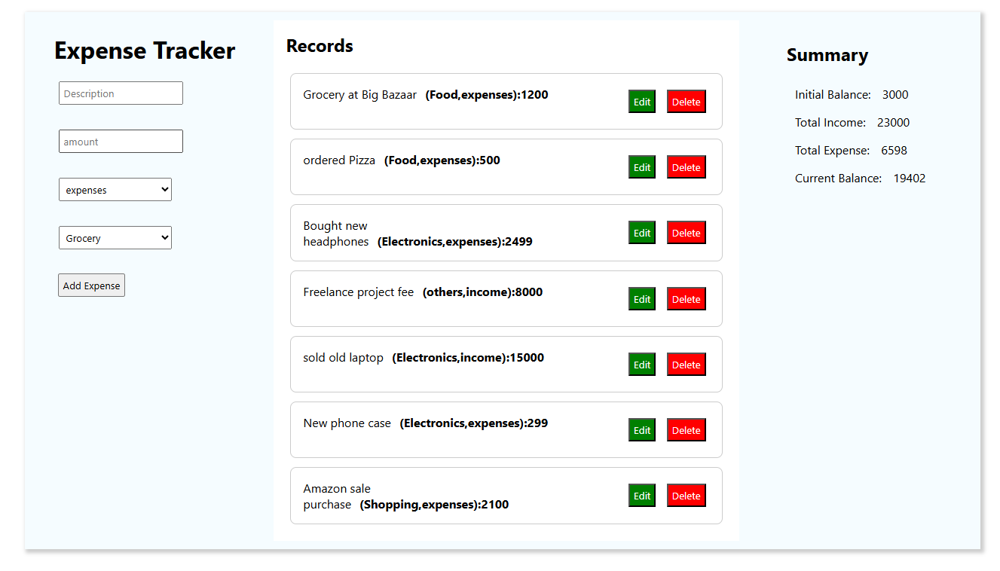

# Expense Tracker V1

A simple, client‑side expense tracking web application that allows you to record, view, edit, and delete expenses. All data is persisted in the browser’s `localStorage`, so your entries remain available even after a page reload.

## Expense Tracker Preview



## Features

* **Add Expense**: Enter an amount, description, expense type (e.g., Income or Expense), and category (e.g., Food, Utilities, Salary).
* **View Expenses**: See a list of all recorded entries with details.
* **Edit Expense**: Modify any existing entry directly from the list.
* **Delete Expense**: Remove entries you no longer need.
* **Persistent Storage**: Data is saved in `localStorage` and automatically loaded on page refresh.

## Technologies Used

* **HTML5**: Semantic structure for forms and lists.
* **CSS3**: Responsive styling to ensure usability across devices.
* **JavaScript (ES6+)**: DOM manipulation, event handling, and `localStorage` API.

## Getting Started

### Installation

1. **Clone the repository**

   ```bash
   git clone https://github.com/ammulu3102/expense_tracker.git
   cd expense-tracker
   ```

2. **Open the application**

   * Double-click `index.html` in your file explorer, or
   * Serve with a simple HTTP server:

     ```bash
     npx http-server .
     ```

### Usage

1. **Add a new expense**: Fill out the form at the top with:

   * **Amount**: Numeric value (e.g., `50.00`).
   * **Description**: Brief text for your entry.
   * **Expense Type**: Select either "Income" or "Expense".
   * **Category**: Choose a predefined category (e.g., "Food", "Transport").
   * Click **Save**.

2. **Edit or delete**

   * In the list below, click **Edit** on any entry to modify.
   * Click **Delete** to remove an entry.
   * Changes are saved automatically to `localStorage`.

> **Note:** Place your `expense_tracker_app_preview.PNG` file in the project root (same folder as `index.html`) so it renders correctly on GitHub.

## Project Structure

```
├── index.html                        # Main HTML file
├── styles.css                        # Application styles
├── expense_tracker.js                # JavaScript logic for CRUD & localStorage
├── expense_tracker_app_preview.PNG   # Preview image (for README)
└── README.md                         # Project documentation
```

## localStorage Schema

The application stores data under the key `expenseData` as a JSON string:

```json
[
  {
    "id": "<uuid>",
    "amount": 100,
    "description": "Groceries",
    "type": "Expense",
    "category": "Food",
    "date": "2025-06-09T14:23:00.000Z"
  },
  ...
]
```

## Contributing

Contributions are welcome! Please open an issue or submit a pull request with improvements.

## License

This project is licensed under the MIT License — see the [LICENSE](LICENSE) file for details.
